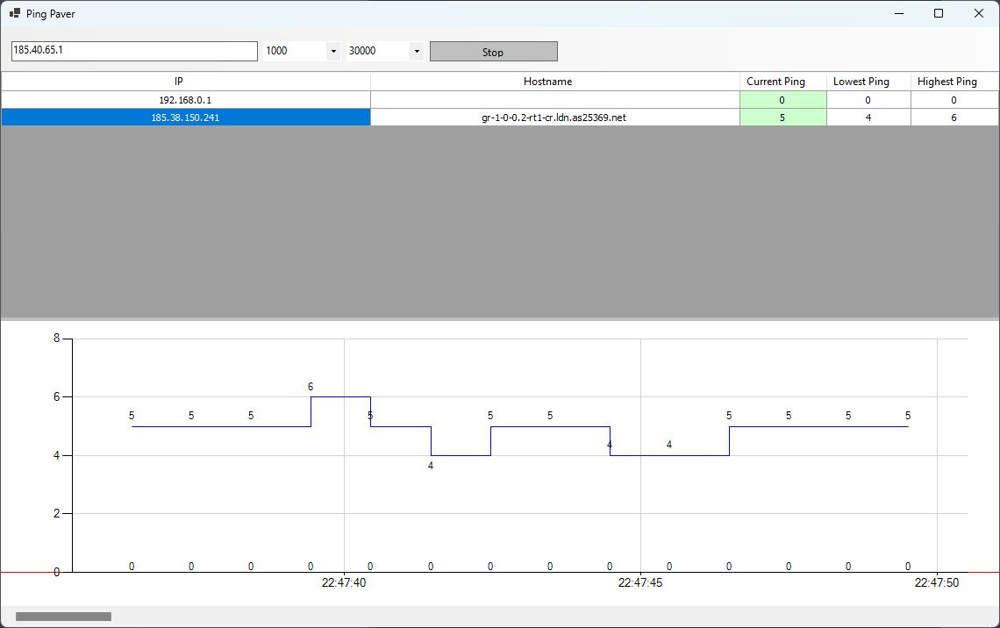

# Ping Paver

Ping Paver is a Windows Forms application that allows you to monitor the ping (network latency) to multiple hosts simultaneously. It provides a graphical representation of the ping history using a line chart and displays real-time ping statistics in a DataGridView.

The idea for Ping Paver came from applications like Ping Plotter, aiming to provide a lightweight and user-friendly ping monitoring solution.

## Features

- Monitor the ping to multiple hosts in real-time.
- View the ping history for each host in a line chart.
- Display current ping statistics, including minimum, maximum, and average ping.
- Customize the ping interval and duration of the ping history.
- Highlight successful and unsuccessful pings in the user interface.

## Changes
- Hop IP Extraction Updated: The method for extracting the hop IP address has been updated to use regular expressions. This allows for more flexibility in matching different IP address formats found in the traceroute results.
- Hop Hostname Update: The application now notifies the user when a hostname couldn't be resolved for a hop. This provides transparency and helps the user understand when no hostname information is available.
- Fixed Empty Cell Selection Error: An error that occurred when empty cells were selected has been resolved. The application now handles empty cell selection gracefully without causing any disruptions.
- Added Final Destination as IP to Ping: The application now includes the final destination IP address as a target to be pinged. This provides a comprehensive overview of the network path, including the final destination.

## Prerequisites

- .NET 6.0 SDK or runtime.

## Getting Started

1. Clone the repository or download the source code.
2. Open the solution in Visual Studio or your preferred development environment.
3. Build the solution to restore dependencies and compile the application.
4. Run the application.

## Usage

1. Enter the host addresses you want to monitor in the application's user interface.
2. Set the ping interval (in milliseconds) to specify how frequently the ping should be sent.
3. Set the ping history duration (in milliseconds) to determine how long the ping history should be stored.
4. Click the "Start" button to start monitoring the ping.
5. The ping statistics and line chart will update in real-time as the pings are received.
6. The DataGridView will display the current ping values and highlight successful and unsuccessful pings.
7. To stop monitoring, click the "Stop" button.

## Screenshots

## Contributing

Contributions are welcome! If you find any bugs or have suggestions for improvement, please open an issue or submit a pull request.

## License

This project is licensed under the [MIT License](LICENSE).

## Acknowledgements

- The application uses the [System.Net.NetworkInformation.Ping](https://docs.microsoft.com/en-us/dotnet/api/system.net.networkinformation.ping) class from the .NET 6.0 framework for sending pings.
- The user interface is built using Windows Forms.
- The charting functionality is provided by the [System.Windows.Forms.DataVisualization.Charting](https://docs.microsoft.com/en-us/dotnet/api/system.windows.forms.datavisualization.charting) namespace.
